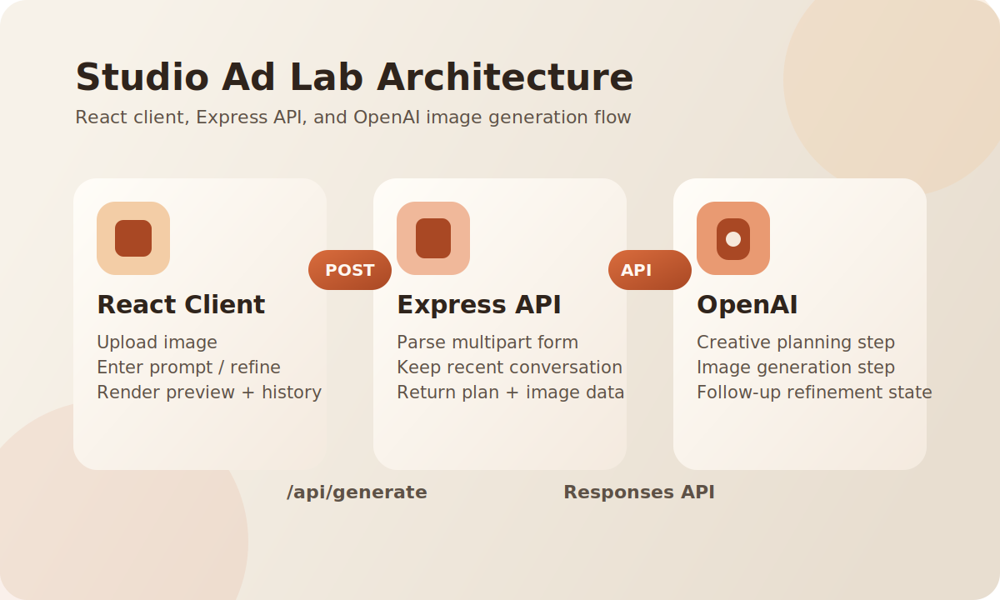

# Studio Ad Lab

## Overview

This project is an AI-powered product ad generator that takes:
- a product image
- a natural-language creative prompt

It returns a generated ad-style image plus a structured creative plan for follow-up refinement.

## Tech Stack

- Frontend: React, TypeScript, Vite
- Backend: Express, TypeScript, Multer
- Models: OpenAI Responses API

## Architecture



System flow:
- React client submits image + prompt to `POST /api/generate`
- Express parses multipart form data and validates first-run vs refinement requests
- OpenAI generates a creative plan first, then the ad image
- API returns image data, plan metadata, and response state for iterative edits

## Project Setup

### Prerequisites

- Node.js `20+`
- OpenAI API key

### 1. Install dependencies

```bash
npm install
```

### 2. Configure environment variables

Create `.env` in the project root:

```env
OPENAI_API_KEY=your_openai_api_key
PORT=8787
```

Notes:
- `OPENAI_API_KEY` is required for `/api/generate`
- `PORT` is optional and defaults to `8787`

### 3. Run the app

```bash
npm run dev
```

Endpoints:
- Frontend: `http://localhost:5173`
- API: `http://localhost:8787`

## Usage

1. Upload a product image.
2. Enter a prompt describing the ad direction.
3. Generate the first version.
4. Refine using follow-up prompts against the latest result.

What to expect:
- First generation requires an uploaded image.
- Refinements reuse prior response state via `previousResponseId`.
- The UI shows the generated image, creative direction, and version history.

## Build

```bash
npm run build
npm start
```

Production serves the built frontend from the Express server.

## Troubleshooting

- `OPENAI_API_KEY is missing.`: add the key to `.env`
- `Prompt is required.`: submit a non-empty prompt
- `An image is required for the first generation.`: upload an image before the first request
- `OpenAI did not return an image.`: retry the request; the upstream generation step returned no image payload
